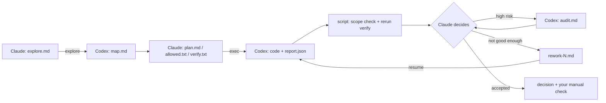

# AI Quota Savior

**Burn less. Do more.** 

Claude leads. Codex grinds. Your quota survives.


[简体中文](README.zh-CN.md)

## Why this exists

**Claude: genius brain, glass-jaw account.**
- Smartest one in the room.
- Also the one most likely to get kicked out of it. Claude Max? Brave.

**Codex: the reliable intern with a bigger lunch budget.**
- 👍 Stable subscription, more quota, more frequent resets. *(Used to be more. Tibo, we need to talk.)*
- 👎 Not as sharp. Left alone, it:
  - reads half the plan,
  - "improves" things nobody asked about,
  - says "Done." Tests? What tests?
  - fixes that one bug. Again.

**So this project squeezes every last drop out of Claude's quota.**
- **Claude is the foreman.** It understands the problem, makes the calls and signs off on the result.
- **Codex is the crew.** It reads, edits and tests, and brings receipts for everything it claims.

AI Quota Savior is a [Claude Code](https://claude.com/claude-code) skill that turns this split into a repeatable workflow.

**Why Claude Code?** Because Claude is the smartest one in the room. This week.

## Measured results

**Same Claude Pro quota. 3.5–4× the work.**

- **Before:** Opus 5.5 on xhigh. A few rounds in, the quota's gone. The rest of the day? Waiting for the reset.
- **Now:** Opus thinks, Codex sweats. Same quota, **3.5–4×** the tasks.

> The author's daily use (Claude Pro · Opus 5.5 · xhigh), not a benchmark. Medium and large features pay off most.

## How it works

**Roles**

- **Claude is the boss.** Thinks, decides, signs off. Barely touches the keyboard.
- **Codex is the crew.** Reads, codes, tests. Pics or it didn't happen.

No magic, just files. Claude writes short memos, Codex hands back reports, and a bash script keeps everyone honest:

| Kind                                         | File                                                    | Purpose                                                                                                                   |
| -------------------------------------------- | ------------------------------------------------------- | ------------------------------------------------------------------------------------------------------------------------- |
| **Skill (fixed)**                            | `SKILL.md`                                              | Claude's playbook: routing, workflow, acceptance standards                                                                |
|                                              | `codex.sh`                                              | The orchestrator. It calls Codex, then runs the scope check, reruns the verification commands, and prints a short summary |
|                                              | `explore-rules.md` / `exec-rules.md` / `audit-rules.md` | Codex's rules for each phase: investigate, implement, audit                                                               |
|                                              | `report-schema.json`                                    | Forces the implementation report into JSON with per-item evidence                                                         |
|                                              | `self-check.py`                                         | Offline test of the whole flow with a mock Codex                                                                          |
| **Per task** (`<repo>/.codex-tasks/<slug>/`) | `explore.md` → `map.md`                                 | Claude's investigation questions → Codex's findings (≤20-line summary plus a full body with `file:line` evidence)         |
|                                              | `plan.md` + `allowed.txt` + `verify.txt`                | The plan with acceptance items `A1…An`, the paths Codex may change, and the commands that must pass                       |
|                                              | `report.json`                                           | Codex's implementation report: a status and evidence for every acceptance item                                            |
|                                              | `audit-plan.md` → `audit.md`                            | Optional independent verification by a fresh Codex session                                                                |
|                                              | `rework-N.md`, `decision.md`                            | Rework instructions; Claude's final verdict                                                                               |





**Key principles**

- **Claude reads the summary, not the novel.** Raw logs stay on disk; full sections only when a decision needs them.
- **Receipts, not vibes.** "Not run" isn't "passed". "It builds" isn't "it works".
- **Trust, then verify.** The script checks scope, reruns the tests outside the sandbox, and fails any reviewer caught editing code.
- **No surprises.** Commits need your OK, nothing gets pushed, two rework rounds max, and no surprise `reset --hard`.

## See it in action


*A real run, not a staged one: every acceptance item (A1–A3) comes with file:line evidence, the scope check is OK, and the tests ran again outside the sandbox. (Codex answered in Chinese because of the author's local settings.)*

## Problems it solves

| Pain | Fix |
|---|---|
| Premium quota burned on grunt work | Grunt work goes to Codex |
| The executor freestyles | Allowed files only; stop at every trade-off |
| "Done!" (no proof) | Evidence for every item, re-checked outside the sandbox |
| "While I was in there…" edits | The scope check against `allowed.txt` catches them |
| The same bug, forever | Two rework rounds max, then you decide |
| New chat, who dis? | Everything lives in task files; pick up where you left off |

## Quick start

**Requirements**

- [Claude Code](https://claude.com/claude-code).
- The [Codex CLI](https://github.com/openai/codex), installed and signed in.
- bash: Git Bash on Windows, the system bash on macOS or Linux.
- A Git repository with at least one commit.

**Install**

```bash
git clone https://github.com/leeluo/AI-Quota-Savior.git
cp -r AI-Quota-Savior/ai-quota-savior ~/.claude/skills/
python ~/.claude/skills/ai-quota-savior/self-check.py   # Windows: pass the Git Bash path as the first argument
```

**Use.** In Claude Code, either type:

```
/ai-quota-savior Add pagination to the project list, 20 items per page
```

or just say *"Use AI Quota Savior and hand this to Codex: …"*.

Claude picks the path itself:

- **Small change**: does it directly.
- **Investigation only**: runs `explore`.
- **Medium or large feature**: investigate → plan → implement → (audit) → decide.

At the end you get two verdicts: "technically accepted" and "your turn to check". Committing? Always your call.

Script reference

```bash
bash ~/.claude/skills/ai-quota-savior/codex.sh <explore|exec|audit|resume|feedback|check> <repo> <slug> [rework-file]
```


| Variable             | Purpose                                                                                             |
| -------------------- | --------------------------------------------------------------------------------------------------- |
| `CODEX_EFFORT`       | Reasoning effort, default `high`                                                                    |
| `CODEX_BIN`          | Path to Codex. Default lookup: the Windows desktop app's newest `codex.exe`, then `codex` on `PATH` |
| `CODEX_CHECKPOINT=1` | Allow committing uncommitted changes as a baseline. Set it only with the user's authorization       |


Sandbox notes

- **The Codex sandbox may block subprocesses, some directories, and local services.**
  - Prefer sandbox-friendly verification commands.
  - The script's rerun outside the sandbox is authoritative. A `partial` report only warns.
- **Ops tasks that need local services or secrets:** Codex writes a script with a dry-run mode; Claude runs it outside the sandbox and reviews the result before applying.
- **One delegation per repo at a time.** Keep other agents out of that repo meanwhile.


## Beyond Claude Code

One rule: **the smart-but-rationed model gives orders; the cheap-and-plentiful one does the work.** The logo on the box doesn't matter.

Say, as a Codex skill:

1. **Command:** Codex's Astra on a cheap plan.
2. **Execute:** DeepSeek, or whatever is cheapest this month.

The workflow, files and checks don't care about vendors; porting means swapping the call in `codex.sh` and the rule files. This repo sticks with Claude + Codex. The door is open; walking through it is up to you.

## License

[MIT](LICENSE) © 2026 Leeluo