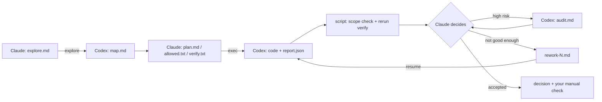

# AI Quota Savior

**Burn less. Do more.** 

Claude leads. Codex grinds. Your quota survives.


[简体中文](README.zh-CN.md)

## Why this exists

**Claude: genius brain, glass-jaw account.**
- It is best-in-class at planning, reasoning and code review.
- Bans happen more often than anyone would like. You pay up for a premium plan, wake up to a suspended account, and your wallet gets banned right along with it.

**Codex: the reliable intern with a bigger lunch budget.**
- 👍 Stable subscription, more quota, more frequent resets. *(The top plan did just get the shrinkflation treatment: same price, half the quota. But hey, the box still looks great.)*
- 👎 Not as sharp. Left unsupervised, it:
  - skims the plan,
  - "improves" three unrelated files,
  - declares victory without running a single test,
  - and keeps fixing the same bug until the heat death of the universe.

**So this project squeezes every last drop out of Claude's quota.**
- **Claude is the foreman.** It understands the problem, makes the calls and signs off on the result.
- **Codex is the crew.** It reads, edits and tests, and brings receipts for everything it claims.

AI Quota Savior is a [Claude Code](https://claude.com/claude-code) skill that turns this split into a repeatable workflow.

**Why Claude Code? Because right now, Claude is the smartest one in the room.** But the AI leaderboard changes hands faster than a hot potato at a toddler's birthday party. If Claude slips, or Codex suddenly gets a lot smarter, we'll just swap roles: Codex makes the plans, something cheaper does the grinding, and this becomes a Codex skill. No brand loyalty here, just quota math. (More in [Beyond Claude Code](#beyond-claude-code).)

## Measured results

**Same Claude Pro quota, 3.5–4× the work.**

- **Before:** with Opus 5.5 on xhigh effort, the quota drains fast, and then you sit waiting for the reset.
- **Now:** Opus only thinks and judges, while Codex does the grinding. The same quota covers **3.5–4× as many tasks**.

> Measured in the author's daily use (Claude Pro · Opus 5.5 · xhigh effort), not a benchmark. Medium and large features gain the most.

## How it works

**Roles**

- **Claude** is the commander. It writes the questions, the plan and the acceptance criteria, and it makes the final call.
- **Codex** is the executor. It investigates, implements and verifies, inside strict boundaries, and it must back every claim with evidence.

Everything is driven by plain files. Claude writes short instruction documents, Codex returns structured reports, and a script connects the two:


| Kind                                         | File                                                    | Purpose                                                                                                                   |
| -------------------------------------------- | ------------------------------------------------------- | ------------------------------------------------------------------------------------------------------------------------- |
| **Skill (fixed)**                            | `SKILL.md`                                              | Claude's playbook: routing, workflow, acceptance standards                                                                |
|                                              | `codex.sh`                                              | The orchestrator. It calls Codex, then runs the scope check, reruns the verification commands, and prints a short summary |
|                                              | `explore-rules.md` / `exec-rules.md` / `audit-rules.md` | Codex's rules for each phase: investigate, implement, audit                                                               |
|                                              | `report-schema.json`                                    | Forces the implementation report into JSON with per-item evidence                                                         |
|                                              | `self-check.py`                                         | Offline test of the whole flow with a mock Codex                                                                          |
| **Per task** (`<repo>/.codex-tasks/<slug>/`) | `explore.md` → `map.md`                                 | Claude's investigation questions → Codex's findings (≤20-line summary plus a full body with `file:line` evidence)         |
|                                              | `plan.md` + `allowed.txt` + `verify.txt`                | The plan with acceptance items `A1…An`, the paths Codex may change, and the commands that must pass                       |
|                                              | `report.json`                                           | Codex's implementation report: a status and evidence for every acceptance item                                            |
|                                              | `audit-plan.md` → `audit.md`                            | Optional independent verification by a fresh Codex session                                                                |
|                                              | `rework-N.md`, `decision.md`                            | Rework instructions; Claude's final verdict                                                                               |





**Key principles**

- **Only the essence reaches Claude.** Raw logs stay on disk. Claude reads summaries, and opens a full section only when a decision depends on it.
- **Evidence over self-reporting.** "Not run" never counts as passed, and "build passes" never stands in for correct behavior.
- **Mechanical checks.** The script checks scope, reruns the verification commands outside the sandbox, and fails explore/audit if they modified tracked files.
- **Safe by default.** Commits are opt-in, there is no auto-push, rework is capped at two rounds, and rollbacks are scoped explicitly.


## See it in action


*Real output after Codex implemented a small task in a demo repo: every acceptance item (A1–A3) comes with file:line evidence, the scope check passes, and the tests are rerun outside the Codex sandbox. Codex wrote its report in Chinese here because of the author's local settings.*

## Problems it solves


| Problem                               | Solution                                                                    |
| ------------------------------------- | --------------------------------------------------------------------------- |
| Premium quota burned on routine work  | Reading, editing, testing and log reading go to Codex                       |
| The executor drifts or over-engineers | Strict rules: allowed paths only, existing style, stop on design trade-offs |
| "Done" without proof                  | Per-item evidence plus re-verification outside the sandbox                  |
| Out-of-scope edits                    | Automatic check against `allowed.txt`                                       |
| Endless fix loops                     | At most two rework rounds, then you decide                                  |
| Losing context between chats          | All state lives in task files, so a new chat can resume                     |


## Quick start

**Requirements**

- [Claude Code](https://claude.com/claude-code).
- The [Codex CLI](https://github.com/openai/codex), installed and signed in.
- bash: Git Bash on Windows, the system bash on macOS or Linux.
- A Git repository with at least one commit.

**Install**

```bash
git clone https://github.com/leeluo/AI-Quota-Savior.git
cp -r AI-Quota-Savior/ai-quota-savior ~/.claude/skills/
python ~/.claude/skills/ai-quota-savior/self-check.py   # Windows: pass the Git Bash path as the first argument
```

**Use.** In Claude Code, either type:

```
/ai-quota-savior Add pagination to the project list, 20 items per page
```

or just say *"Use AI Quota Savior and hand this to Codex: …"*.

Claude picks the path itself:

- **Small change**: does it directly.
- **Investigation only**: runs `explore`.
- **Medium or large feature**: investigate → plan → implement → (audit) → decide.

It reports "technically accepted" separately from "pending your manual check". Committing is always up to you.

Script reference

```bash
bash ~/.claude/skills/ai-quota-savior/codex.sh <explore|exec|audit|resume|feedback|check> <repo> <slug> [rework-file]
```


| Variable             | Purpose                                                                                             |
| -------------------- | --------------------------------------------------------------------------------------------------- |
| `CODEX_EFFORT`       | Reasoning effort, default `high`                                                                    |
| `CODEX_BIN`          | Path to Codex. Default lookup: the Windows desktop app's newest `codex.exe`, then `codex` on `PATH` |
| `CODEX_CHECKPOINT=1` | Allow committing uncommitted changes as a baseline. Set it only with the user's authorization       |


Sandbox notes

- **The Codex sandbox may block subprocesses, some directories, and local services.**
  - Prefer sandbox-friendly verification commands.
  - The script's rerun outside the sandbox is authoritative. A `partial` report only warns.
- **Ops tasks that need local services or secrets:** Codex writes a script with a dry-run mode; Claude runs it outside the sandbox and reviews the result before applying.
- **One delegation per repo at a time.** Keep other agents out of that repo meanwhile.


## Beyond Claude Code

This skill is built for Claude Code, but the idea works with **any** pair of models: **let a smarter, quota-limited model command, and let a cheaper, higher-quota model execute.**

For example, you could adapt it into a **Codex skill**:

- **Command**: a Codex model such as Astra, on an affordable plan.
- **Execute**: DeepSeek or another low-cost model.

The workflow, file contracts and checks don't depend on any particular vendor, so porting mostly means swapping the call in `codex.sh` and the rule files. This repository focuses on the Claude + Codex setup and doesn't ship ports; it just leaves the door open.

## License

[MIT](LICENSE) © 2026 Leeluo