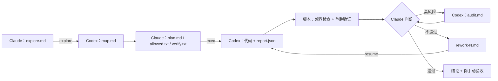
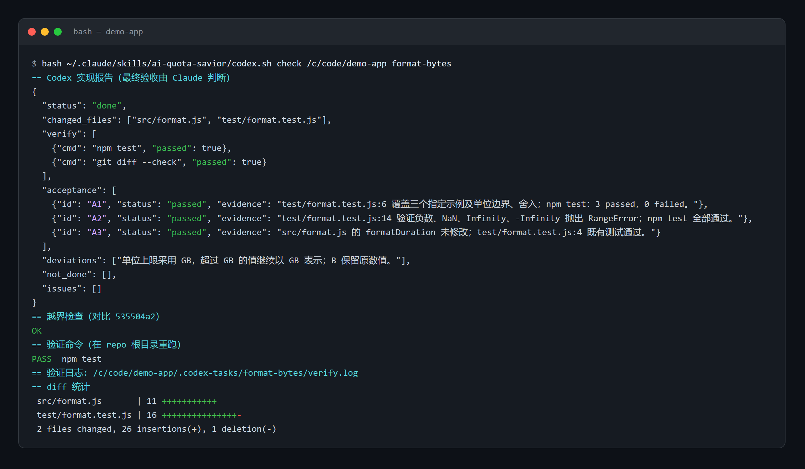

# AI Quota Savior

**少烧额度，多干活。** 

Claude 带队，Codex 肝活，额度保命。


[English](README.md)

## 为什么做这个项目

**Claude：聪明是真聪明，封号也是真封号。**
- 规划、推理、代码审查，样样顶尖。
- 但封号来得比额度重置还勤。咬牙充了个大会员，第二天号没了，钱包和心态一起归零。

**Codex：老实可靠的打工人，就是脑子没那么灵光。**
- 👍 会员稳、额度多、重置勤。（顶配套餐最近也跟薯片学了一招：袋子没变，价格没变，里面一半变成了空气。）
- 👎 模型效果差点意思。放养它的话，它会：
  - 方案看一半就开干；
  - 顺手"优化"三个不相干的文件；
  - 一个测试没跑就宣布"搞定了"；
  - 同一个 bug 修到天荒地老。

**于是有了这个项目：把 Claude 的每一滴额度都榨出来。**
- **Claude 当包工头**：理解问题、拍板方案、最后验收。
- **Codex 当施工队**：读代码、改代码、跑测试，每个结论都要拿出证据。

AI Quota Savior 是一个 [Claude Code](https://claude.com/claude-code) skill，把这种分工固化成一套可以重复使用的流程。

**为什么是 Claude Code？因为眼下 Claude 是屋里最聪明的那个，所以它当包工头。** 但各家 AI 卷得太凶，榜一的位置比奶茶店的新品换得还快。哪天 Claude 拉胯了，或者 Codex 突然开窍了，那就换岗：Codex 来做方案，更便宜的模型去干活，这个 skill 也就顺势变成 Codex 的 skill。这里不讲忠诚，只算额度。（详见文末[不止于 Claude Code](#补充说明不止于-claude-code)。）

## 实测效果

**同一份 Claude Pro 额度，现在能干 3.5~4 倍的活。**

- **以前**：Opus 5.5 开到 xhigh，额度很快见底，剩下的时间只能干等重置。
- **现在**：Opus 只负责想和判断，脏活累活都交给 Codex，同样的额度能完成 **3.5~4 倍**的任务量。

> 作者日常真实使用的实测数据（Claude Pro · Opus 5.5 · 推理强度 xhigh），不是基准测试；中大型功能开发收益最大。

## 设计思路

**角色分工**

- **Claude 是指挥**：写调查问题、方案和验收标准，并做最终判断。
- **Codex 是执行者**：在严格的边界内调查、实现、验证，每个结论都必须拿出证据。

整个流程靠普通文件驱动：Claude 写简短的指令文档，Codex 交回结构化的报告，中间由一个脚本串起来。


| 类别                                      | 文件                                                      | 作用                                                          |
| --------------------------------------- | ------------------------------------------------------- | ----------------------------------------------------------- |
| **Skill 本体（固定）**                        | `SKILL.md`                                              | Claude 的操作手册：任务分流、流程、验收标准                                   |
|                                         | `codex.sh`                                              | 调度脚本：调用 Codex，然后做越界检查、重跑验证命令，只输出精简结果                        |
|                                         | `explore-rules.md` / `exec-rules.md` / `audit-rules.md` | Codex 在调查、实现、验收三个阶段要遵守的规则                                   |
|                                         | `report-schema.json`                                    | 强制 Codex 用 JSON 汇报，每个验收项都要附证据                               |
|                                         | `self-check.py`                                         | 用模拟的 Codex 离线测试整个流程                                         |
| **每个任务**（`<repo>/.codex-tasks/<slug>/`） | `explore.md` → `map.md`                                 | Claude 的调查问题 → Codex 的调查结果（不超过 20 行的摘要 + 带 `文件:行号` 证据的完整正文） |
|                                         | `plan.md` + `allowed.txt` + `verify.txt`                | 带验收项 `A1…An` 的方案、允许 Codex 修改的路径、必须通过的命令                     |
|                                         | `report.json`                                           | Codex 的实现报告：整体状态，以及每个验收项的证据                                 |
|                                         | `audit-plan.md` → `audit.md`                            | 可选：开一个新的 Codex 会话独立验收                                       |
|                                         | `rework-N.md`、`decision.md`                             | 返工要求；Claude 的最终结论                                           |





**几条核心原则**

- **只把精华放进 Claude 的上下文。** 原始日志留在磁盘上。Claude 读摘要，只有决策依赖细节时才打开对应章节。
- **用证据说话，不信自报。** "没运行"不能算通过，"构建通过"也不能代替"行为正确"。
- **机械核实。** 脚本自动做越界检查，在沙箱外重跑验证命令；如果调查或验收阶段改动了已跟踪的源码，直接判定失败。
- **默认安全。** 自动提交要显式开启，不会自动 push；返工最多两轮；回滚前先明确范围。


## 实际效果



*Codex 在 demo 仓库里完成一个小任务后的真实输出：每个验收项（A1–A3）都附带 文件:行号 证据，越界检查通过，测试在 Codex 沙箱外重新运行通过。*

## 解决的问题


| 问题            | 怎么解决                          |
| ------------- | ----------------------------- |
| 贵模型的额度耗在日常杂活上 | 读代码、改代码、跑测试、看日志都交给 Codex      |
| 执行者跑偏、过度设计    | 严格规则：只改允许的路径，保持现有风格，遇到设计取舍就停下 |
| 没有证据就说"完成了"   | 逐项提交证据，并在沙箱外重新验证              |
| 改了不该改的文件      | 按 `allowed.txt` 自动做越界检查       |
| 无限返工          | 最多两轮，之后由你决定                   |
| 换对话就丢上下文      | 所有状态都在任务文件里，新对话可以接着做          |


## 快速开始

**环境要求**

- [Claude Code](https://claude.com/claude-code)。
- [Codex CLI](https://github.com/openai/codex)，已安装并登录。
- bash：Windows 用 Git Bash，macOS 和 Linux 用系统自带的 bash。
- 工作目录是至少有一次提交的 Git 仓库。

**安装**

```bash
git clone https://github.com/leeluo/AI-Quota-Savior.git
cp -r AI-Quota-Savior/ai-quota-savior ~/.claude/skills/
python ~/.claude/skills/ai-quota-savior/self-check.py   # Windows 需把 Git Bash 路径作为第一个参数
```

**使用**：在 Claude Code 里输入

```
/ai-quota-savior 给项目列表加分页，每页 20 条
```

或者直接说"用 AI Quota Savior，把这个任务交给 Codex：……"。

Claude 会自己选做法：

- **小改动**：直接改。
- **只是想了解代码**：只做调查（`explore`）。
- **中大型功能**：调查 → 方案 → 实现 →（验收执行）→ 判断。

最后它会把"技术验收通过"和"待你手动验收"分开汇报，要不要提交始终由你决定。

脚本参数

```bash
bash ~/.claude/skills/ai-quota-savior/codex.sh <explore|exec|audit|resume|feedback|check> <repo> <slug> [返工文件]
```


| 环境变量                 | 作用                                                                 |
| -------------------- | ------------------------------------------------------------------ |
| `CODEX_EFFORT`       | 推理强度，默认 `high`                                                     |
| `CODEX_BIN`          | Codex 的路径。默认查找顺序：Windows 桌面端里最新的 `codex.exe`，然后是 `PATH` 里的 `codex` |
| `CODEX_CHECKPOINT=1` | 允许把未提交的改动提交成基线。只有在用户授权后才能设置                                        |


沙箱注意事项

- **Codex 沙箱可能无法启动子进程、写入某些目录或访问本机服务。**
  - 验证命令尽量选沙箱里能跑的写法。
  - 一律以脚本在沙箱外重跑的结果为准。报告是 `partial` 时只给警告，不判失败。
- **需要访问本机服务或密钥的运维任务**：Codex 写好带 dry-run（空跑）模式的脚本，Claude 在沙箱外先空跑，核对无误后再执行。
- **同一个仓库同一时间只跑一个委派**，期间也不要让其他智能体修改这个仓库。


## 补充说明：不止于 Claude Code

这个 skill 是给 Claude Code 用的，但同样的思路可以用在**任何** AI 模型上。核心就一句话：**用智能更高、但额度少的模型做指挥，让额度更多、性价比更高的模型做执行。**

举个例子，你可以把它改造成一个 **Codex 的 skill**：

1. **策略指挥**：用 Codex 的 Astra 或其他内部模型，开一个比较便宜的会员就够了。
2. **执行**：交给 DeepSeek 或其他更便宜的模型。

流程、文件约定和各项检查都不依赖特定厂商，迁移时主要替换 `codex.sh` 里的调用和规则文件。本仓库目前只做 Claude + Codex 这一种组合，暂不提供迁移版本，只是给出这种可能性，留一个口子。

## 许可证

[MIT](LICENSE) © 2026 Leeluo