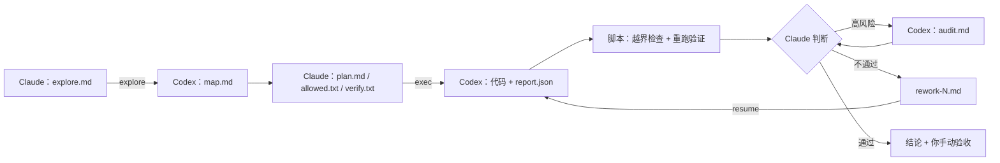

# AI Quota Savior

**少烧额度，多干活。** 

Claude 带队，Codex 肝活，额度保命。


[English](README.md)

## 为什么做这个项目

**Claude：聪明是真聪明，封号也是真封号。**
- 屋里最聪明的那个。
- 也是最容易被请出屋的那个。开 Claude Max？勇士。

**Codex：老实可靠的打工人，就是脑子没那么灵光。**
- 👍 会员稳、额度多、重置勤。（以前更多。Tibo，我们得聊聊。）
- 👎 脑子差点意思。放养的话：
  - 方案只看一半；
  - 顺手"优化"了没人让动的地方；
  - "搞定了。"测试？什么测试？
  - 那个 bug，又修好了。第五次。

**于是有了这个项目：把 Claude 的每一滴额度都榨出来。**
- **Claude 当包工头**：理解问题、拍板方案、最后验收。
- **Codex 当施工队**：读代码、改代码、跑测试，每个结论都要拿出证据。

AI Quota Savior 是一个 [Claude Code](https://claude.com/claude-code) skill，把这种分工固化成一套可以重复使用的流程。

**为什么是 Claude Code？** 因为 Claude 现在最聪明。这周。

## 实测效果

**同一份 Claude Pro 额度，干 3.5~4 倍的活。**

- **以前**：Opus 5.5 开 xhigh，没聊几轮额度就见底。剩下的时间？等重置。
- **现在**：Opus 只动脑，体力活全给 Codex。额度还是那份额度，活多干了 **3.5~4 倍**。

> 作者日常实测（Claude Pro · Opus 5.5 · xhigh），不是跑分。中大型功能最划算。

## 设计思路

**角色分工**

- **Claude 是老板**：动脑、拍板、签字验收，键盘基本不碰。
- **Codex 是施工队**：读、写、测，口说无凭，证据说话。

没有魔法，全靠文件：Claude 写几份简短的指令，Codex 交回报告，一个 bash 脚本负责让大家都老实点。

| 类别                                      | 文件                                                      | 作用                                                          |
| --------------------------------------- | ------------------------------------------------------- | ----------------------------------------------------------- |
| **Skill 本体（固定）**                        | `SKILL.md`                                              | Claude 的操作手册：任务分流、流程、验收标准                                   |
|                                         | `codex.sh`                                              | 调度脚本：调用 Codex，然后做越界检查、重跑验证命令，只输出精简结果                        |
|                                         | `explore-rules.md` / `exec-rules.md` / `audit-rules.md` | Codex 在调查、实现、验收三个阶段要遵守的规则                                   |
|                                         | `report-schema.json`                                    | 强制 Codex 用 JSON 汇报，每个验收项都要附证据                               |
|                                         | `self-check.py`                                         | 用模拟的 Codex 离线测试整个流程                                         |
| **每个任务**（`<repo>/.codex-tasks/<slug>/`） | `explore.md` → `map.md`                                 | Claude 的调查问题 → Codex 的调查结果（不超过 20 行的摘要 + 带 `文件:行号` 证据的完整正文） |
|                                         | `plan.md` + `allowed.txt` + `verify.txt`                | 带验收项 `A1…An` 的方案、允许 Codex 修改的路径、必须通过的命令                     |
|                                         | `report.json`                                           | Codex 的实现报告：整体状态，以及每个验收项的证据                                 |
|                                         | `audit-plan.md` → `audit.md`                            | 可选：开一个新的 Codex 会话独立验收                                       |
|                                         | `rework-N.md`、`decision.md`                             | 返工要求；Claude 的最终结论                                           |





**几条核心原则**

- **Claude 只看摘要，不看小说。** 原始日志留在磁盘上，正文按需翻。
- **要证据，不要感觉。** "没跑"不算通过，"能编译"不等于能用。
- **先信任，再核实。** 脚本查越界、在沙箱外重跑测试；谁在验收时偷偷改代码，直接判失败。
- **不搞突然袭击。** 提交要你点头，不自动 push，返工最多两轮，不会冷不丁来个 `reset --hard`。

## 实际效果


*真实运行，不是摆拍：A1–A3 每项都带 文件:行号 证据，越界检查 OK，测试在沙箱外又跑了一遍。*

## 解决的问题

| 痛点 | 解法 |
|---|---|
| 贵模型的额度烧在搬砖上 | 搬砖交给 Codex |
| 执行者自由发挥 | 只准改白名单里的文件，遇到取舍就停 |
| "做完了"，但拿不出证据 | 每项都要证据，脚本在沙箱外再验一遍 |
| "顺手"改了不该改的 | 按 `allowed.txt` 做越界检查，当场抓包 |
| 一个 bug 修到地老天荒 | 返工最多两轮，然后你说了算 |
| 换个对话就失忆 | 进度全在任务文件里，接着干 |

## 快速开始

**环境要求**

- [Claude Code](https://claude.com/claude-code)。
- [Codex CLI](https://github.com/openai/codex)，已安装并登录。
- bash：Windows 用 Git Bash，macOS 和 Linux 用系统自带的 bash。
- 工作目录是至少有一次提交的 Git 仓库。

**安装**

```bash
git clone https://github.com/leeluo/AI-Quota-Savior.git
cp -r AI-Quota-Savior/ai-quota-savior ~/.claude/skills/
python ~/.claude/skills/ai-quota-savior/self-check.py   # Windows 需把 Git Bash 路径作为第一个参数
```

**使用**：在 Claude Code 里输入

```
/ai-quota-savior 给项目列表加分页，每页 20 条
```

或者直接说"用 AI Quota Savior，把这个任务交给 Codex：……"。

Claude 会自己选做法：

- **小改动**：直接改。
- **只是想了解代码**：只做调查（`explore`）。
- **中大型功能**：调查 → 方案 → 实现 →（验收执行）→ 判断。

最后你会拿到两个结论："技术验收通过"和"轮到你验收了"。提交？永远你说了算。

脚本参数

```bash
bash ~/.claude/skills/ai-quota-savior/codex.sh <explore|exec|audit|resume|feedback|check> <repo> <slug> [返工文件]
```


| 环境变量                 | 作用                                                                 |
| -------------------- | ------------------------------------------------------------------ |
| `CODEX_EFFORT`       | 推理强度，默认 `high`                                                     |
| `CODEX_BIN`          | Codex 的路径。默认查找顺序：Windows 桌面端里最新的 `codex.exe`，然后是 `PATH` 里的 `codex` |
| `CODEX_CHECKPOINT=1` | 允许把未提交的改动提交成基线。只有在用户授权后才能设置                                        |


沙箱注意事项

- **Codex 沙箱可能无法启动子进程、写入某些目录或访问本机服务。**
  - 验证命令尽量选沙箱里能跑的写法。
  - 一律以脚本在沙箱外重跑的结果为准。报告是 `partial` 时只给警告，不判失败。
- **需要访问本机服务或密钥的运维任务**：Codex 写好带 dry-run（空跑）模式的脚本，Claude 在沙箱外先空跑，核对无误后再执行。
- **同一个仓库同一时间只跑一个委派**，期间也不要让其他智能体修改这个仓库。


## 补充说明：不止于 Claude Code

核心就一句话：**聪明但额度少的当指挥，额度多又便宜的去干活。** 跟哪家模型没关系。

比如改成 Codex skill：

1. **指挥**：Codex 的 Astra，开个便宜会员就行。
2. **干活**：DeepSeek，或者这个月最便宜的那个。

流程、文件、检查都不认厂商，换人只要改 `codex.sh` 里的调用和规则文件。本仓库只管 Claude + Codex 这一对。门留着，进不进你自己定。

## 许可证

[MIT](LICENSE) © 2026 Leeluo